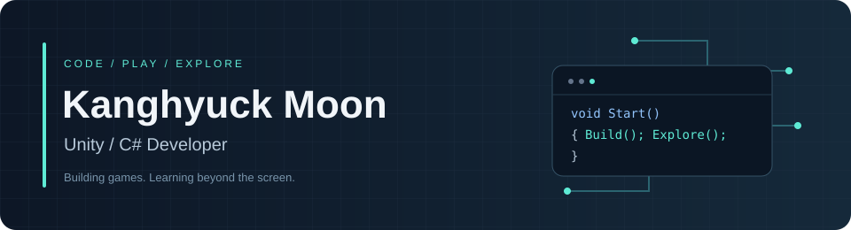
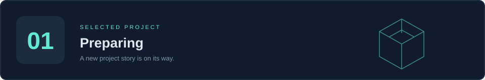
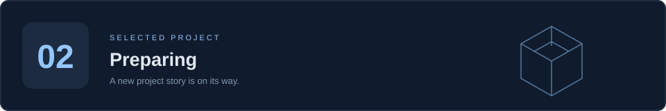
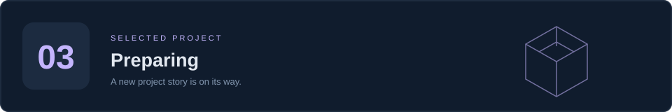

  

<h1 align="center">문강혁 · Kanghyuck Moon</h1>

<strong>Unity / C# Developer</strong>

Unity와 C#으로 게임을 만들고, 하드웨어와 AI로 개발의 영역을 넓혀갑니다.

  
  
  

블로그 준비 중 · 게임 개발과 새로운 기술을 배우는 과정을 기록합니다.

---

## Tech Stack

### 주력 기술

Unity와 C#을 중심으로 게임을 개발합니다.

### 최근 공부하고 있어요

Verilog / FPGA, Embedded / AI를 공부하며 소프트웨어와 하드웨어를 함께 이해하는 개발자로 성장하고 있습니다.

## Selected Projects

대표 프로젝트를 정리하고 있습니다.

<!-- PROJECTS:START -->
<!-- 프로젝트를 갱신할 때 아래 카드의 제목, 이미지 경로, 설명, 기술, 링크를 수정하세요. docs/PROFILE_GUIDE.md 참고. -->

### 01 · 준비 중

프로젝트 소개와 주요 구현 내용을 준비하고 있습니다.

<!-- 기술: `Unity` · `C#` -->
[공개 저장소 둘러보기 ↗](https://github.com/KanghyuckMoon?tab=repositories)

### 02 · 준비 중

프로젝트 소개와 주요 구현 내용을 준비하고 있습니다.

<!-- 기술: `Unity` · `C#` -->
[공개 저장소 둘러보기 ↗](https://github.com/KanghyuckMoon?tab=repositories)

### 03 · 준비 중

프로젝트 소개와 주요 구현 내용을 준비하고 있습니다.

<!-- 기술: `Unity` · `C#` -->
[공개 저장소 둘러보기 ↗](https://github.com/KanghyuckMoon?tab=repositories)

<!-- PROJECTS:END -->

## Dev Log

[**KanghyuckMoon.github.io ↗**](https://kanghyuckmoon.github.io)

게임 개발과 Verilog / FPGA, Embedded / AI 학습 기록을 남길 공간입니다.

### 최근 글

<!-- BLOG-POST-LIST:START -->
블로그를 준비하고 있습니다. 첫 개발 기록이 올라오면 최신 글 3개가 이곳에 표시됩니다.
<!-- BLOG-POST-LIST:END -->

---

Build with Unity. Explore beyond the screen.

